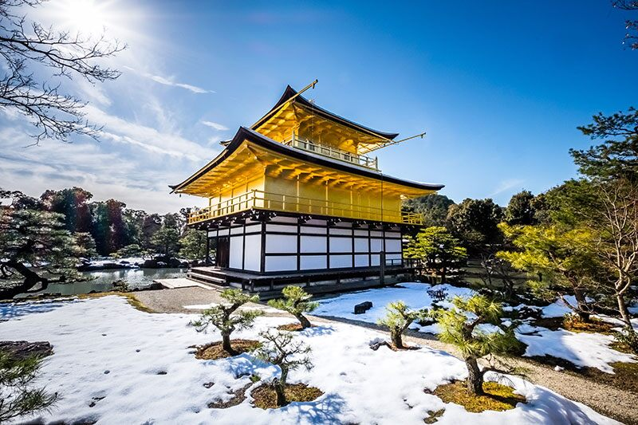

## 1- For being a center stage

Japan is becoming a center stage in the world for international and sporting events; such as G7, G20, FIVB world cup, Rugby world cup, 2020 Tokyo Olympics. 

I believe Japan is one of the few countries that can provide the most required necessities to host the world events. Japan has safe cities and towns, clean environment, well-designed transportation services, rich & delicious cuisine, friendly and humble citizens and so forth.

## 2- For being a popular tourist destination

Japan is attracting more tourists than ever before. It is a popular tourist destination for the international travelers. The number of visitors to Japan has been increasing annually.

According to Japan National Tourism Organization; In 2017, 28.6 million, in 2018, 31.1 million foreign tourists visited Japan.

While millions of tourists coming to, staying in and travelling Japan, we (Japanese) must be better communicators than currently we are. English can be a very handy to accomplish this, because it is the main international language.

To be able to show Japanese hospitality to the visitors, we should communicate well with them. If Yamada-San speaks English he can talk to Dieter from Germany, Lucas from Spain, Camila from Argentina.

Tourists are not limited to Kyoto, Tokyo, Osaka, they also visit small cities, towns. Chance of interacting with a tourist getting higher each year for a Japanese citizen.

Wouldn’t it be great when tourists ask for direction, if we could assist them and recommend some local attractions or local food to them!

The better the communication, the happier the visitors.

So, English will be very helpful for overcoming the barriers between tourists and the locals.

