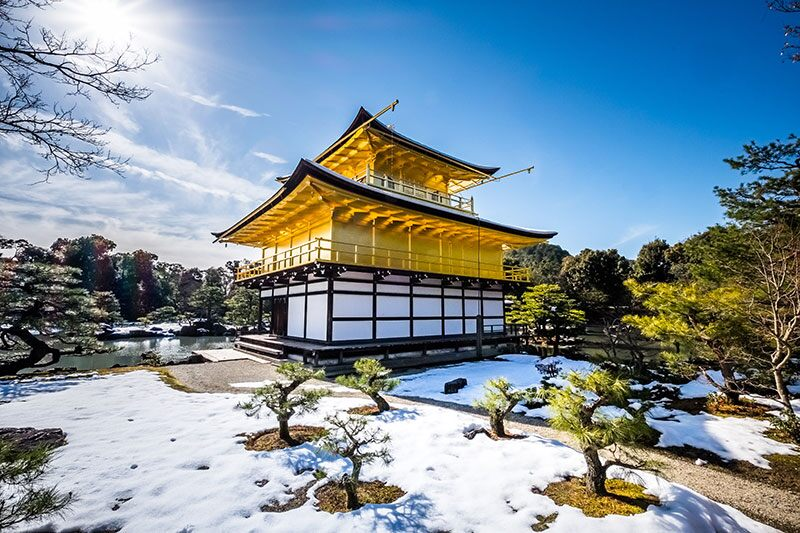

## センターステージであること

日本は、国際的なイベントやスポーツイベントの中心的存在になりつつあります。 G7、G20、FIVBワールドカップ、ラグビーワールドカップ、2020年東京オリンピック。

日本は世界のイベントを開催するために最も必要な必需品を提供できる数少ない国の一つだと思います。日本には、安全な都市と町、清潔な環境、適切に設計された輸送サービス、豊富で美味しい料理、フレンドリーで謙虚な市民などがいます。

## 人気のある観光地であること

日本はこれまで以上に多くの観光客を集めています。国際的な旅行者に人気のある観光地です。日本への訪問者の数は毎年増加しています。

日本政府観光局によると; 2017年には2860万人、2018年には3110万人の外国人観光客が日本を訪れました。

何百万人もの観光客が日本に来て、日本に滞在し、旅行していますが、私たち（日本人）は現在よりも優れたコミュニケーターでなければなりません。 英語は主要な国際言語であるため、これを達成するには非常に便利です。

訪問者に日本のおもてなしを示すことができるように、私たちは彼らとうまくコミュニケーションをとるべきです。 山田さんが英語を話せば、ドイツのディーター、スペインのルーカス、アルゼンチンのカミラと話すことができます。

観光客は京都、東京、大阪に限らず、小さな都市や町も訪れます。日本人にとって毎年高くなる観光客との交流の機会。

観光客が道を尋ねるとき、私たちが彼らを助けて、彼らにいくつかの地元のアトラクションや地元の食べ物を勧めることができたら素晴らしいことではないでしょう。

コミュニケーションが良くなればなるほど、観光客は幸せになります。

したがって、英語は観光客と地元の人々の間の障壁を克服するのに非常に役立ちます。

